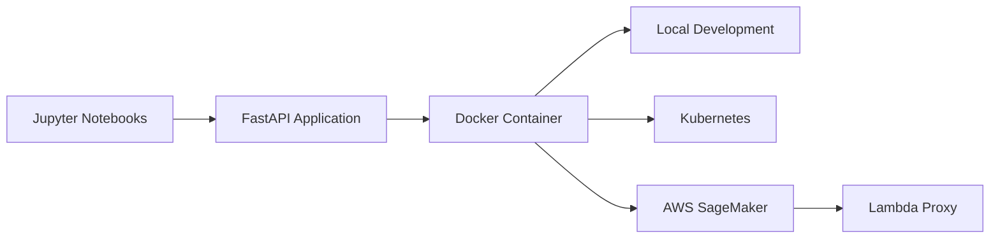

# Titanic BYOC: ML Model Deployment Pipeline

[](https://github.com/ddhangdd/titanic-byoc)
[](https://www.python.org/downloads/)
[](https://fastapi.tiangolo.com)
[](https://www.docker.com)
[](https://aws.amazon.com/sagemaker/)

> A complete ML deployment pipeline demonstrating "Bring Your Own Container" (BYOC) patterns for deploying a Titanic survival prediction model across multiple platforms.


[Overview](#overview) • [Features](#features) • [Getting Started](#getting-started) • [Deployment](#deployment) • [API Reference](#api-reference) • [Testing](#testing)

---

## Overview

This project demonstrates a complete machine learning deployment pipeline, taking a Titanic survival prediction model from Jupyter notebooks to production-ready endpoints across multiple platforms. Built around the popular [Kaggle Titanic dataset](https://www.kaggle.com/c/titanic), this project serves as a comprehensive guide for ML practitioners looking to understand containerized model deployment.

### What You'll Learn

- **ML Pipeline Development**: Feature engineering and model training with scikit-learn
- **API Development**: REST API creation with FastAPI and proper endpoint design
- **Containerization**: Docker packaging for consistent deployment environments
- **Cloud Deployment**: AWS SageMaker endpoint creation and management
- **Local Development**: Kubernetes deployment with Minikube
- **Testing Strategies**: Comprehensive testing across all deployment targets

### Project Architecture



## Features

- **High-Performance Model**: Random Forest classifier achieving 83.4% accuracy
- **Production-Ready API**: FastAPI with health checks and proper error handling
- **Multi-Platform Deployment**: Local, Kubernetes, and AWS SageMaker support
- **Containerized**: Docker-based deployment for consistency across environments
- **Comprehensive Testing**: Unit tests, integration tests, and deployment verification
- **AWS Integration**: SageMaker endpoint with Lambda proxy for simplified testing
- **Development Workflow**: Complete pipeline from data exploration to production deployment

## Getting Started

### Prerequisites

Before you begin, ensure you have the following installed:

- **Python 3.8.8**: Required for package compatibility
- **Docker**: For containerization and deployment
- **AWS CLI**: For SageMaker deployment (configured with credentials)
- **Node.js** (optional): For additional tooling

### Quick Start

1. **Clone the repository**

   ```bash
   git clone https://github.com/ddhangdd/titanic-byoc.git
   cd titanic-byoc
   ```

2. **Set up Python environment**

   ```bash
   python -m venv venv_py38
   source venv_py38/bin/activate  # On Windows: venv_py38\Scripts\activate
   pip install -r dependencies/requirements.txt
   ```

3. **Run locally**

   ```bash
   cd container
   uvicorn api:api --reload --host 0.0.0.0 --port 8000
   ```

4. **Test the API**
   ```bash
   curl http://localhost:8000/ping
   curl -X POST http://localhost:8000/invocations \
     -H "Content-Type: application/json" \
     -d @tests/test_json/test_json.json
   ```

### Alternative Setup Methods

<details>
<summary><strong>Docker Development</strong></summary>

```bash
# Build the container
docker build -t titanic-byoc:dev .

# Run the container
docker run -p 8080:8080 titanic-byoc:dev

# Test the containerized API
curl http://localhost:8080/ping
```

</details>

<details>
<summary><strong>Kubernetes (Minikube)</strong></summary>

```bash
# Start Minikube
minikube start

# Load Docker image
minikube image load titanic-byoc:dev

# Deploy to Kubernetes
kubectl apply -f k8s/api-deployment.yaml

# Get service URL
minikube service titanic-api --url
```

</details>

## Deployment

### Local Development

The fastest way to get started is with local development:

```bash
cd container
uvicorn api:api --reload --host 0.0.0.0 --port 8000
```

This starts the FastAPI server with hot reload enabled for development.

### Docker Deployment

For production-like testing, use Docker:

```bash
# Build the image
docker build -t titanic-byoc:latest .

# Run the container
docker run -p 8080:8080 titanic-byoc:latest
```

### AWS SageMaker Deployment

> [!NOTE]
> Requires AWS CLI configured with appropriate permissions.

1. **Create ECR repository**

   ```bash
   aws ecr create-repository --repository-name titanic-model --region us-east-1
   ```

2. **Push Docker image**

   ```bash
   # Get login token
   aws ecr get-login-password --region us-east-1 | \
     docker login --username AWS --password-stdin <account-id>.dkr.ecr.us-east-1.amazonaws.com

   # Tag and push
   docker tag titanic-byoc:latest <account-id>.dkr.ecr.us-east-1.amazonaws.com/titanic-model:latest
   docker push <account-id>.dkr.ecr.us-east-1.amazonaws.com/titanic-model:latest
   ```

3. **Create SageMaker endpoint**
   ```bash
   # Create model
   aws sagemaker create-model \
     --model-name titanic-model-$(date +%s) \
     --primary-container Image=<account-id>.dkr.ecr.us-east-1.amazonaws.com/titanic-model:latest \
     --execution-role-arn arn:aws:iam::<account-id>:role/SageMakerExecutionRole
   ```

For detailed deployment instructions, see the [DEPLOYMENT_GUIDE.md](DEPLOYMENT_GUIDE.md).

### Kubernetes Deployment

Deploy to a local Kubernetes cluster using Minikube:

```bash
# Apply deployment configuration
kubectl apply -f k8s/api-deployment.yaml

# Check deployment status
kubectl get pods

# Access the service
minikube service titanic-api --url
```

## API Reference

The API provides two main endpoints following SageMaker conventions:

### Health Check

```http
GET /ping
```

**Response:**

```json
{
  "status": "healthy!"
}
```

### Prediction

```http
POST /invocations
```

**Request Body:**

```json
{
  "Pclass": 3,
  "Sex": "male",
  "Age": 22,
  "SibSp": 1,
  "Parch": 0,
  "Fare": 7.25,
  "Embarked": "S"
}
```

**Response:**

```json
{
  "survival_prediction": 0
}
```

Where `0` = Did not survive, `1` = Survived

### Example Usage

```bash
# Health check
curl http://localhost:8000/ping

# Make prediction
curl -X POST http://localhost:8000/invocations \
  -H "Content-Type: application/json" \
  -d '{
    "Pclass": 1,
    "Sex": "female",
    "Age": 29,
    "SibSp": 0,
    "Parch": 0,
    "Fare": 211.3375,
    "Embarked": "S"
  }'
```

## Testing

The project includes comprehensive testing across all deployment targets.

### Unit Tests

Run the unit test suite:

```bash
cd tests
bash test_scripts/run_unit_tests.sh
```

This generates a test report in `tests/test_reports/unit_test_report.txt`.

### Integration Testing

Test different deployment targets:

```bash
# Local FastAPI
bash tests/curl_scripts/local_predict.sh

# Minikube deployment
bash tests/curl_scripts/minikube_predict.sh

# AWS SageMaker
bash tests/curl_scripts/aws_predict.sh
```

### Lambda Proxy Testing

For simplified SageMaker testing, use the Lambda proxy function:

```python
# Deploy the Lambda function in aws/lambdas/invoke_endpoint.py
# Then test via HTTP POST without AWS authentication
```

## Project Structure

```
titanic-byoc-v2/
├── notebooks/                    # Jupyter notebooks for ML development
│   ├── data-exploration.ipynb
│   ├── feature-engineering.ipynb
│   └── predictive-modeling.ipynb
├── container/                    # FastAPI application
│   ├── api.py                   # Main API endpoints
│   ├── serve                    # Uvicorn startup script
│   └── train.py                 # Model training script
├── models/                      # Trained model artifacts
│   ├── rfc_model.pkl
│   └── rfc_pipeline.pkl         # Complete ML pipeline
├── data/                        # Training and test data
│   ├── raw/                     # Original Kaggle datasets
│   └── clean/                   # Processed features
├── aws/                         # AWS deployment files
│   └── lambdas/
│       └── invoke_endpoint.py   # SageMaker proxy function
├── k8s/                         # Kubernetes deployment
│   ├── api-deployment.yaml
│   └── README.md
├── tests/                       # Testing infrastructure
│   ├── unit_tests/
│   ├── test_json/              # Test data files
│   ├── curl_scripts/           # Deployment test scripts
│   └── test_scripts/
├── dependencies/
│   └── requirements.txt         # Exact package versions
├── Dockerfile                   # Container definition
└── DEPLOYMENT_GUIDE.md         # Detailed deployment instructions
```

## Dataset Information

The project uses the famous [Kaggle Titanic dataset](https://www.kaggle.com/c/titanic), which contains passenger information from the RMS Titanic.

### Features Used in Model

| Feature    | Description                       | Type        | Included |
| ---------- | --------------------------------- | ----------- | -------- |
| `Pclass`   | Passenger class (1st, 2nd, 3rd)   | Categorical | ✅       |
| `Sex`      | Gender                            | Categorical | ✅       |
| `Age`      | Age in years                      | Numerical   | ✅       |
| `SibSp`    | Number of siblings/spouses aboard | Numerical   | ✅       |
| `Parch`    | Number of parents/children aboard | Numerical   | ✅       |
| `Fare`     | Passenger fare                    | Numerical   | ✅       |
| `Embarked` | Port of embarkation               | Categorical | ✅       |
| `Survived` | Survival (0 = No, 1 = Yes)        | Target      | ✅       |

### Model Performance

- **Algorithm**: Random Forest Classifier
- **Accuracy**: 83.4%
- **Features**: 7 input features with engineered age bins
- **Pipeline**: Complete preprocessing and prediction pipeline

## Key Technologies

- **Machine Learning**: scikit-learn, pandas, cloudpickle
- **API Framework**: FastAPI with Uvicorn ASGI server
- **Containerization**: Docker with Python 3.8 slim base
- **Cloud Platform**: AWS SageMaker for serverless ML inference
- **Orchestration**: Kubernetes for container management
- **Testing**: Comprehensive unit and integration test suite

## Deployment Targets

| Platform          | Purpose       | Access Method           | Notes                       |
| ----------------- | ------------- | ----------------------- | --------------------------- |
| **Local**         | Development   | `http://localhost:8000` | Hot reload enabled          |
| **Docker**        | Testing       | `http://localhost:8080` | Production-like environment |
| **Kubernetes**    | Orchestration | Minikube service URL    | Local cluster deployment    |
| **AWS SageMaker** | Production    | HTTPS endpoint          | Serverless, auto-scaling    |
| **Lambda Proxy**  | Testing       | HTTP POST               | Simplifies SageMaker access |

## Resources

- [Deployment Guide](DEPLOYMENT_GUIDE.md) - Detailed step-by-step instructions
- [Quick Reference](QUICK_REFERENCE.md) - Commands and endpoints cheatsheet
- [Kaggle Titanic Competition](https://www.kaggle.com/c/titanic) - Original dataset source
- [YouTube Playlist](https://youtube.com/playlist?list=PLNBQNFhVrlVSAi9jIm6K5dWhcD1L372_G) - Live coding sessions

## Troubleshooting

### Common Issues

<details>
<summary><strong>Package Compatibility Errors</strong></summary>

**Issue**: NumPy version conflicts with category-encoders

**Solution**: Ensure you're using the exact versions in `dependencies/requirements.txt`:

```
numpy<1.20
category-encoders==2.2.2
```

</details>

<details>
<summary><strong>Docker Container Exits Immediately</strong></summary>

**Issue**: Container stops after starting

**Solution**: Verify the `CMD` instruction in Dockerfile and ensure the `serve` script is executable:

```bash
chmod +x container/serve
```

</details>

<details>
<summary><strong>SageMaker Endpoint Not Responding</strong></summary>

**Issue**: 500 errors from SageMaker endpoint

**Solution**: Check CloudWatch logs and ensure the container is using the correct endpoint paths (`/ping` and `/invocations`).

</details>

---

**⭐ If you find this project helpful, please give it a star on GitHub!**
